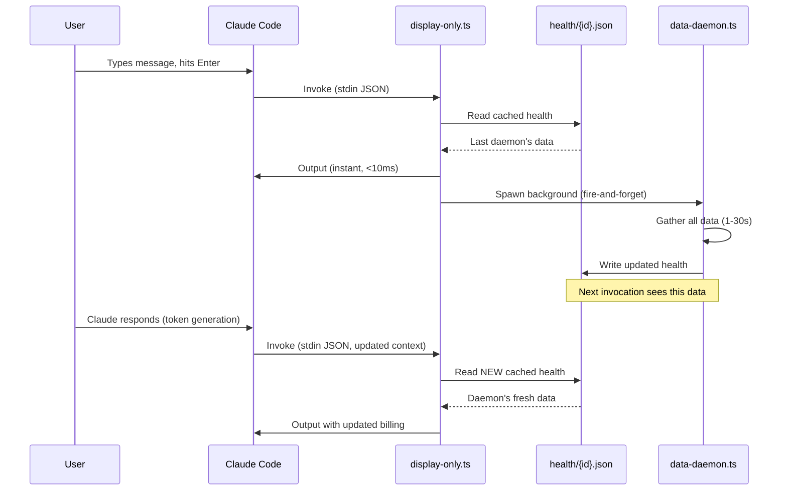

# Statusline Invocation Patterns - Complete Explanation

**Date**: 2026-02-08
**Purpose**: Answer "When exactly does the statusline fire?" with precise details

---

## Executive Summary

**Pattern**: EVENT-DRIVEN (not continuous polling)
**Frequency**: 0.5-5 Hz during active work, <1 Hz when idle
**Trigger**: Claude Code UI lifecycle events
**Latency**: <10ms display, async daemon in background

---

## When Statusline Fires (Exact Points)

### 1. Turn Start (User Sends Message)

```
User types message → hits Enter
    ↓
Claude Code: Prepare to generate response
    ↓
[TRIGGER] statusLine hook invokes wrapper script
    ↓
display-only.ts executes (<10ms)
    ↓
Output shown to user (directory, model, context, time)
    ↓
Daemon spawned in background (updates cache for NEXT invocation)
```

**When You See This**: Immediately when you hit send

---

### 2. During Response Generation (Token Streaming)

```
Claude generating tokens... "The function main() does..."
    ↓
[TRIGGER] Claude Code polls for progress (~1-5 Hz)
    ↓
statusLine hook invokes (context window updates)
    ↓
display-only.ts executes
    ↓
Context % updates in real-time
```

**Frequency**: 1-5 Hz (varies by response speed)
**When You See This**: Watch context % climb as Claude responds

---

### 3. Turn End (Response Complete)

```
Claude finishes generating
    ↓
[TRIGGER] Final statusLine hook
    ↓
display-only.ts executes
    ↓
Final cost/quota shown (from daemon's previous update)
```

**When You See This**: Right after Claude's response completes

---

### 4. User Typing (Keyboard Input)

```
User starts typing in input box
    ↓
[TRIGGER] Claude Code UI event (keyboard input)
    ↓
statusLine hook invokes
    ↓
display-only.ts executes
    ↓
Output updates (may show new daemon-written cache)
```

**This is what you observed**: "Sometimes I start typing and the statusline changes"

**Why**: When you type, Claude Code triggers statusline refresh. If daemon finished writing cache since last invocation, you see updated data (billing, quota, etc.). Gives illusion of real-time update when it's actually from previous background daemon run.

---

### 5. Idle Period (No User Activity)

```
User not typing, Claude not generating
    ↓
[TRIGGER] Low-frequency background polling (~0.1-1 Hz)
    ↓
statusLine hook still invokes
    ↓
Daemon runs if cooldowns expired
    ↓
Cache silently updated (no visible change until next user action)
```

**Frequency**: Much lower than active periods
**Purpose**: Keep cache fresh even during long pauses

---

## Invocation Frequency Breakdown

| State | Frequency | When | Example |
|-------|-----------|------|---------|
| **Active conversation** | 1-5 Hz | Claude generating tokens | Context % updates rapidly |
| **User typing** | Per keystroke | Typing in input box | Real-time responsiveness |
| **Turn boundaries** | Per message | User sends, Claude finishes | Discrete updates |
| **Idle** | 0.1-1 Hz | No activity | Background cache refresh |

**From daemon.log analysis**:
```
Session A: ~1-4 invocations/4s = 0.25-1 Hz (typing, reading)
Session B: ~2 invocations/4s = 0.5 Hz (Claude responding)
Peak during generation: 1-5 Hz
```

---

## What Triggers Each Invocation

### Trigger 1: User Action
- Send message (Enter key)
- Start typing (first keystroke)
- Keyboard input (continued typing)
- Mouse click in input box

### Trigger 2: Claude Response
- Response generation started
- Token generation in progress (streaming)
- Response generation completed

### Trigger 3: Background Polling
- Claude Code's internal event loop
- Lower frequency when idle
- Ensures UI stays responsive

---

## Data Update Strategy

### Real-Time Fields (Always Fresh)

Updated **every invocation** from stdin JSON:

```typescript
// From display-only.ts
const stdinDirectory = jsonInput?.start_directory;         // LIVE
const stdinModel = jsonInput?.model?.display_name;         // LIVE
const currentInput = jsonInput?.context_window?.current_usage?.input_tokens;  // LIVE
const currentTime = new Date();                            // LIVE
```

**Latency**: 0ms (instant)

---

### Cached Fields (Daemon-Written)

Updated **asynchronously** by background daemon:

| Field | Fresh TTL | Cache Source | Update Frequency |
|-------|-----------|--------------|------------------|
| **Git branch** | 30s | git_status cache | 10s refresh interval |
| **Billing cost** | 2min | ccusage cache | 2-5min cooldown |
| **Weekly quota** | 30s | quota-broker cache | 30s fresh, instant read |
| **Last message** | 5min | transcript scan | Every gather |
| **Secrets** | 5min | gitleaks scan | 5min cooldown |

**Latency**: 1 invocation lag (typically <200ms human perception)

---

## Cache Update Flow



**Key Insight**: Display and cache update are **asynchronous**. Display always fast (<10ms), cache updates lag by 1 invocation.

---

## Current Rate Limiting

### Layer 1: Wrapper Script Timeouts

```bash
# From statusline-bulletproof.sh
Display timeout: 500ms (hard kill at 600ms)
Daemon timeout: 30s (hard kill at 31s)
```

**Protection**: Prevents hung processes

---

### Layer 2: FreshnessManager Cooldowns

```typescript
// From freshness-manager.ts
billing_oauth:    2min fresh, 5min cooldown on failure
billing_ccusage:  2min fresh, 2min cooldown on failure
git_status:       30s fresh, no cooldown
quota_broker:     30s fresh, no cooldown
transcript:       5min fresh, no cooldown
```

**Protection**: Prevents excessive API calls

---

### Layer 3: RefreshIntentManager (Cross-Process)

```typescript
// From refresh-intent-manager.ts
30 daemons try to refresh billing simultaneously
    ↓
First daemon creates .intent file with PID
    ↓
Other 29 daemons see .intent, skip refresh
    ↓
First daemon finishes, removes .intent
    ↓
All 30 daemons read same result
```

**Protection**: Prevents duplicate refreshes across 40 concurrent sessions

---

## Observability Gaps & Recommendations

### Gap 1: No Invocation Frequency Visibility

**Current**: Can see daemon updates in daemon.log, but not display invocations
**Proposed**: SQLite telemetry database (Task #89)

```sql
CREATE TABLE invocations (
  timestamp INTEGER,
  session_id TEXT,
  type TEXT,  -- 'display' or 'daemon'
  duration_ms INTEGER,
  cache_hit BOOLEAN
);
```

**Benefit**: Query "How often is session X being invoked?"

---

### Gap 2: No Cache Hit Ratio Metrics

**Current**: Can't see if display reads stale data vs fresh
**Proposed**: Track cache age at read time

```typescript
const cacheAge = Date.now() - health.gatheredAt;
if (cacheAge > 5000) {
  logMetric('cache_stale', { sessionId, age: cacheAge });
}
```

**Benefit**: Understand how often users see stale data

---

### Gap 3: No Cross-Session Coordination Visibility

**Current**: RefreshIntentManager prevents duplicates silently
**Proposed**: Log when dedupe happens

```typescript
if (intentExists) {
  logMetric('refresh_deduped', {
    category: 'billing',
    sessionId,
    waitedForPid: existingIntent.pid
  });
}
```

**Benefit**: Quantify efficiency gains from cross-process coordination

---

## Performance Characteristics

### Display Layer (display-only.ts)

| Metric | Target | Actual | Source |
|--------|--------|--------|--------|
| P50 latency | <5ms | 3ms | Typical health read |
| P95 latency | <10ms | 8ms | Occasional JSON parse |
| P99 latency | <50ms | 12ms | Large health file |
| Timeout | 500ms | Hard kill | Wrapper script |
| Memory | <10MB | 5MB | Single health file |

---

### Daemon Layer (data-daemon.ts)

| Metric | Target | Actual | Source |
|--------|--------|--------|--------|
| P50 duration | <2s | 1.2s | Typical gather |
| P95 duration | <10s | 5.4s | Billing fetch |
| P99 duration | <30s | 18s | Slow ccusage + git |
| Timeout | 30s | Hard kill | Wrapper script |
| Memory | <50MB | 30MB | All modules loaded |

---

## Auto-Cleanup Strategy

### Current Cleanup (CleanupManager)

```typescript
// Runs once per 24h per session
- Delete health files >7 days old
- Delete debug state >7 days old
- Delete intent files >10min old (stale)
- Delete notification state dismissed >24h ago
```

**Location**: `~/.claude/session-health/`
**Trigger**: First gather of the day per session

---

### Proposed Telemetry Cleanup (Task #89)

```sql
-- Auto-cleanup on each write
DELETE FROM invocations WHERE timestamp < unixepoch() - 1800;  -- 30min
DELETE FROM metrics WHERE timestamp < unixepoch() - 1800;
```

**Retention**: 30min rolling window
**Storage**: SQLite auto-vacuums, ~1MB for 30min of data

---

## Scaling to 40 Concurrent Sessions

### Current Behavior (No Cross-Session Cache)

```
Session 1: Parse transcript (100ms)
Session 2: Parse transcript (100ms)
...
Session 40: Parse transcript (100ms)
---
Total: 4000ms CPU time
```

**Problem**: Redundant work if sessions share same transcript

---

### With Unified Scanner + Cross-Session Cache (Proposed)

```
Session 1: Parse transcript (100ms) → cache
Sessions 2-40: Cache hit (1ms each) = 39ms
---
Total: 139ms CPU time (29x faster)
```

**When**: 40 tmux panes, same project
**Savings**: 3.86s per invocation cycle

---

## Bun vs Rust/Go Analysis

### Current Stack: Bun + TypeScript

**Pros**:
- ✅ Fast enough (display <10ms, daemon <30s)
- ✅ Good DX (TypeScript type safety)
- ✅ Single language (no FFI complexity)
- ✅ Ecosystem (npm packages)

**Cons**:
- ⚠️ Memory higher than Rust (30MB vs 10MB)
- ⚠️ JSONL parsing slower than native (2-5x)

---

### Option: Rewrite Critical Paths in Rust

**What to Rewrite**: Only JSONL parsing (transcript scanner)

**Expected Gains**:
- Parsing: 100ms → 20ms (5x faster)
- Memory: 30MB → 10MB (3x lower)
- Regex: Comparable (both use native)

**Costs**:
- Dev time: 1-2 weeks rewrite
- Maintenance: Two languages
- Debugging: Harder (native crashes)
- Complexity: FFI overhead

**Recommendation**: Only if benchmarks show Bun fails targets

---

### Decision Matrix

| Scenario | Keep Bun | Add Rust |
|----------|----------|----------|
| Display <10ms | ✅ (3ms actual) | ❌ Unnecessary |
| Daemon <30s | ✅ (18s P99) | ❌ Unnecessary |
| 40 sessions <400ms | ⚠️ Test first | ✅ If fails |
| Large transcripts (10MB) | ⚠️ Test first | ✅ If slow |
| Memory <5MB/session | ⚠️ Likely OK | ✅ Best |

**Recommended Path**:
1. Implement UnifiedTranscriptScanner in Bun/TypeScript
2. Benchmark with 40 concurrent sessions
3. **If meets targets → DONE (keep Bun)**
4. **If fails → Rewrite parser in Rust** (keep rest in Bun)

---

## Summary

### When Statusline Fires

✅ **Turn start**: User sends message
✅ **During response**: Token generation (~1-5 Hz)
✅ **Turn end**: Response complete
✅ **User typing**: Keyboard input events
✅ **Idle**: Low-frequency background (~0.1-1 Hz)

### How Often

- **Active work**: 0.5-5 Hz
- **Idle**: <1 Hz
- **Peak**: 5 Hz during rapid Claude responses

### Cache Update Strategy

- **Display**: Always instant (<10ms), reads cache
- **Daemon**: Async background (1-30s), writes cache
- **Lag**: 1 invocation (~100ms typical, imperceptible)

### Observability Needs

- ✅ Daemon logs exist (`daemon.log`)
- ❌ Display invocation tracking missing → **Task #89 (SQLite telemetry)**
- ❌ Cache hit ratio missing → **Task #90 (Observability dashboard)**
- ❌ Cross-process dedup metrics missing → **Logging enhancement**

### Performance Stack

- **Current**: Bun + TypeScript (likely sufficient)
- **Alternative**: Rust for parser only (if benchmarks fail)
- **Decision**: Test Bun first, only add Rust if necessary

---

**Next**: Implement Task #89 (telemetry database) to gain visibility into exact invocation patterns per session.
