# Transcript Scanner Architecture - Visual Guide

**Date**: 2026-02-07
**Purpose**: Architectural diagrams for unified transcript scanning system

---

## Current Architecture (Fragmented)

```mermaid
graph TB
    A[Claude Code Invocation] -->|stdin JSON| B[display-only.ts]
    B -->|read| C[health/{sessionId}.json]
    C --> B
    B -->|stdout| D[Statusline Output]

    A -->|background| E[data-daemon.ts]
    E --> F[UnifiedDataBroker.gatherAll]

    F -->|Tier 2| G[TranscriptSource]
    F -->|Tier 2| H[SecretsSource]
    F -->|Tier 2| I[AuthSource]

    G -->|calls| J[IncrementalTranscriptScanner]
    J -->|read| K[transcript.jsonl]
    J -->|state| L[cooldowns/transcript.state]

    H -->|calls| M[GitLeaksScanner]
    M -->|read| K
    M -->|subprocess| N[gitleaks CLI]
    M -->|state| O[cooldowns/gitleaks.state]

    I -->|calls| P[TranscriptMonitor]
    P -->|read| K
    P -->|NO STATE| Q[Re-scans every time]

    style K fill:#f99
    style Q fill:#f99

    J --> R[LastMessage + Count]
    M --> S[Secrets Found]
    P --> T[Health Metrics]

    R --> U[SessionHealth]
    S --> U
    T --> U

    U --> C
```

**Problems**:
- 🔴 Transcript read 3 times independently
- 🔴 No coordination between scanners
- 🔴 TranscriptMonitor has no state (re-scans)
- 🔴 Gitleaks CLI subprocess overhead (100-500ms)

---

## Proposed Architecture (Unified)

```mermaid
graph TB
    A[Claude Code Invocation] -->|stdin JSON| B[display-only.ts]
    B -->|read| C[health/{sessionId}.json]
    C --> B
    B -->|stdout| D[Statusline Output]

    A -->|background| E[data-daemon.ts]
    E --> F[UnifiedDataBroker.gatherAll]

    F -->|Tier 2| G[NEW: TranscriptScannerSource]

    G -->|single call| H[UnifiedTranscriptScanner]

    H -->|1. Load state| I[scanners/{sessionId}.state]
    H -->|2. Check cache| J{Mtime/Size Changed?}

    J -->|NO| K[Return Cached Result]
    J -->|YES| L[IncrementalReader]

    L -->|read new bytes only| M[transcript.jsonl]

    L --> N[LineParser]
    N -->|parsed lines| O[Parallel Extractors]

    O --> P[LastMessageExtractor]
    O --> Q[SecretDetector Native]
    O --> R[CommandDetector NEW]
    O --> S[AuthChangeDetector NEW]

    P --> T[LastMessage]
    Q --> U[Secrets]
    R --> V[Commands]
    S --> W[Auth Changes]

    T --> X[Composite Result]
    U --> X
    V --> X
    W --> X

    X -->|update state| I
    X -->|cache 10s| Y[Memory Cache]
    X --> Z[SessionHealth]

    style H fill:#9f9
    style O fill:#9f9
    style M fill:#9f9

    Z --> C
```

**Benefits**:
- ✅ Single transcript read
- ✅ All extractors run on same parsed data
- ✅ Unified state management
- ✅ Native secret detection (no subprocess)
- ✅ New capabilities: command/auth detection

---

## Data Flow: Incremental Scanning


---

## Account Switch Detection Flow


---

## Session Account Locking Flow


---

## Extractor Plugin Architecture


**Benefits**:
- Add new extractors without modifying core
- Each extractor independently testable
- Future extensions easy (analytics, custom patterns)

---

## Performance: 40 Concurrent Sessions


**Scenario**: 40 tmux panes, same project
- **Current**: Each session scans independently = 4000ms total
- **Unified**: First session parses (100ms), rest cache hit (1ms) = 139ms total
- **Improvement**: 29x faster

---

## State File Schema Evolution

```mermaid
graph LR
    A[V1: Separate Files] --> B[V2: Unified State]

    subgraph V1 Current
        C[cooldowns/<br/>transcript.state]
        D[cooldowns/<br/>gitleaks.state]
        E[No state for<br/>TranscriptMonitor]
    end

    subgraph V2 Unified
        F[scanners/<br/>{sessionId}.state]
        F --> G[version: 2]
        F --> H[lastOffset: 1000]
        F --> I[lastMtime: T]
        F --> J[extractorData]
        J --> K[lastMessage: ...]
        J --> L[secrets: ...]
        J --> M[commands: ...]
        J --> N[authChanges: ...]
    end

    A --> C
    A --> D
    A --> E

    B --> F

    style E fill:#f99
    style F fill:#9f9
```

---

## Notification Display Timeline


**Timeline**:
- T+0ms: User runs /login
- T+100ms: Command written to transcript
- T+200ms: Next statusline invocation
- T+225ms: Notification registered and shown
- T+30s: Notification hidden (5min)
- T+5min30s: Notification shown again (30s)
- Repeats until dismissed or 24h expiry

---

## Memory Usage Comparison


**Improvement**: 3x memory reduction per session

---

## Implementation Phases


**Current Status**: Phase 0 (Specification) ✅ Complete

---

## Testing Strategy Pyramid

```mermaid
graph TB
    A[E2E Tests<br/>5 tests] --> B[Integration Tests<br/>20 tests]
    B --> C[Unit Tests<br/>100 tests]

    subgraph E2E
        A1[Full account switch flow]
        A2[40 concurrent sessions]
        A3[Large transcript 10MB]
    end

    subgraph Integration
        B1[Scanner → Extractors → State]
        B2[Auth detection → Lock update]
        B3[Notification registration]
    end

    subgraph Unit
        C1[IncrementalReader cache hits]
        C2[LineParser JSONL parsing]
        C3[Each extractor independently]
        C4[State persistence]
    end

    style C fill:#9f9
    style B fill:#ff9
    style A fill:#f99
```



---

This visual guide provides complete architectural understanding for implementing the unified transcript scanning system with account switch detection and ultra-efficient performance for 40+ concurrent sessions.
