# Statusline v2 - Architecture Diagrams

## System Overview


---

## Data Flow: Single Session Request


---

## Session Isolation Mechanism

```mermaid
graph LR
    subgraph "Session A (Chat 123)"
        SA[Request:<br/>sessionId=123]
    end

    subgraph "Session B (Chat 456)"
        SB[Request:<br/>sessionId=456]
    end

    subgraph "Broker Cache"
        subgraph "Session-Specific Data"
            CA123["context:123<br/>model:123<br/>transcript:123"]
            CA456["context:456<br/>model:456<br/>transcript:456"]
        end

        subgraph "Shared Data"
            SHARED["cost:shared<br/>git:repoPath"]
        end
    end

    SA -->|read| CA123
    SA -->|read| SHARED
    SB -->|read| CA456
    SB -->|read| SHARED

    SA -.->|❌ CANNOT read| CA456
    SB -.->|❌ CANNOT read| CA123

    style CA123 fill:#e1f5e1
    style CA456 fill:#fff4e1
    style SHARED fill:#e1f0ff
```



**Key Insight:**
- Session 123 can ONLY read `context:123`, `model:123`, etc.
- Sessions share expensive data (`cost:shared`, `git:repoPath`)
- Cache keys include session ID for isolation

---

## Module Fetch Deduplication


**Result:** 15 parallel sessions = 1 ccusage fetch (vs v1's 15 fetches)

---

## Validation Pipeline

```mermaid
graph TD
    FETCH[Module Fetches Data]
    VALIDATE{Validator:<br/>Data Valid?}
    SANITIZE[Sanitize Data]
    CACHED{Cached<br/>Fallback<br/>Exists?}
    DEFAULT[Use Default Value]
    STALE[Mark as Stale 🔴]
    RENDER[Render Output]

    FETCH -->|raw data| VALIDATE
    VALIDATE -->|✅ Valid| RENDER
    VALIDATE -->|❌ Invalid| SANITIZE
    SANITIZE -->|Can Fix| STALE
    SANITIZE -->|Cannot Fix| CACHED
    CACHED -->|Yes| STALE
    CACHED -->|No| DEFAULT
    STALE --> RENDER
    DEFAULT --> RENDER

    style VALIDATE fill:#fff4e1
    style RENDER fill:#e1f5e1
    style DEFAULT fill:#ffe1e1
```



**Validation Rules:**
- Context: `currentTokens <= contextWindow`, `sessionId` format
- Git: `ahead/behind` are integers, branch name valid
- Cost: `costUSD >= 0`, `burnRate >= 0`, timestamps valid
- Model: Model name in known list, not empty string

---

## Cache Eviction Strategy


**Eviction Policy (LRU):**
1. Track `lastAccessedAt` on every cache read
2. When cache reaches max size (1000 entries)
3. Find entry with oldest `lastAccessedAt`
4. Remove it, insert new entry

**Session Timeout:**
- If session inactive for >1 hour, evict all session-specific entries
- Shared entries (`cost:shared`) never evicted due to timeout

---

## Renderer Deduplication

```mermaid
sequenceDiagram
    participant Broker
    participant Renderer
    participant HashStore
    participant Output

    Broker->>Renderer: render(sessionId, moduleData)

    Renderer->>Renderer: Format each module
    Note over Renderer: Context: 🧠:156kleft<br/>Git: 🌿:main+5/-0<br/>Cost: 💰:$42.3

    Renderer->>Renderer: Concatenate sections
    Note over Renderer: Full output string

    Renderer->>Renderer: Compute MD5 hash
    Renderer->>HashStore: Get last hash for session
    HashStore-->>Renderer: previousHash

    alt Hash Changed
        Renderer->>Output: Print statusline
        Renderer->>HashStore: Save new hash
    else Hash Identical
        Note over Renderer: Skip printing<br/>(prevent flicker)
    end
```



**Why Deduplication Matters:**
- Terminal redraws cause flicker
- If data hasn't changed, don't redraw
- Hash comparison is <1ms, print is ~5ms

---

## Error Recovery Flow

```mermaid
graph TD
    START[Module Fetch Starts]
    TIMEOUT{Timeout?}
    RETRY{Retry<br/>Available?}
    SUCCESS{Success?}
    CACHED{Cached<br/>Data?}
    STALE[Use Cached + 🔴]
    DEFAULT[Use Default]
    RENDER[Render Output]
    LOG[Log Error to Sentry]

    START --> TIMEOUT
    TIMEOUT -->|No| SUCCESS
    TIMEOUT -->|Yes| RETRY
    RETRY -->|Yes| START
    RETRY -->|No| LOG

    SUCCESS -->|Yes| RENDER
    SUCCESS -->|No| CACHED

    CACHED -->|Yes| STALE
    CACHED -->|No| DEFAULT

    STALE --> RENDER
    DEFAULT --> RENDER
    LOG --> CACHED

    style SUCCESS fill:#e1f5e1
    style STALE fill:#fff4e1
    style DEFAULT fill:#ffe1e1
    style LOG fill:#ffd4d4
```



**Retry Policy:**
- Max 2 retries for git module
- Max 1 retry for cost module (expensive)
- Max 0 retries for context module (cheap, should never fail)
- Exponential backoff: 100ms, 200ms, 400ms

---

## Performance: Parallel Fetch


**Speedup:**
- v1 sequential: 20.16 seconds (cold start)
- v2 parallel: 20 seconds (cold start, limited by slowest module)
- v2 cached: 5ms (hot path)

**Why v2 Cached is Fast:**
- All modules read from in-memory cache
- No subprocess spawns (ccusage, git)
- No file I/O (except final print)

---

## Configuration Cascade


**Priority (highest to lowest):**
1. CLI flags (most specific)
2. Environment variables
3. User config file
4. Default config file

**Example:**
```bash
# Default: cost refresh = 3 minutes
# User config: cost refresh = 5 minutes
# ENV: STATUSLINE_MODULE_COST_REFRESH=300000 (5 min)
# CLI: --refresh-cost=10m

# Result: 10 minutes (CLI wins)
```

---

## Memory Layout


**Memory Target: <15MB per statusline process**

**Cache Entry Size Estimate:**
- Key: `"context:session-id-123"` = ~30 bytes
- Value: JSON data = ~500 bytes average
- Metadata: timestamps, counts = ~100 bytes
- **Total per entry: ~630 bytes**
- **1000 entries: ~630KB** (but JSON data can be larger, so ~5MB realistic)

**Optimization:**
- Use weak maps for automatic GC
- Serialize large objects only when needed
- Compress transcript data in cache

---

This completes the architectural diagram suite for statusline v2.
