# OAuth Token Architecture — Hot-Swap Multi-Account System

**Date**: 2026-02-09
**Status**: DOCUMENTED

---

## Token Lifecycle

```mermaid
sequenceDiagram
    participant User
    participant ClaudeCLI as Claude CLI
    participant Browser
    participant AuthAPI as console.anthropic.com
    participant Keychain as macOS Keychain
    participant Cron as Cron Job
    participant StatusAPI as api.anthropic.com

    %% Initial Login
    User->>ClaudeCLI: claude1 (or claude /login)
    ClaudeCLI->>Browser: Open OAuth flow
    Browser->>AuthAPI: User authenticates
    AuthAPI->>Browser: OAuth callback with code
    Browser->>ClaudeCLI: Authorization code
    ClaudeCLI->>AuthAPI: Exchange code for tokens
    AuthAPI->>ClaudeCLI: accessToken + refreshToken + expiresAt
    ClaudeCLI->>Keychain: Store credentials in slot-specific entry
    Note over Keychain: Claude Code-credentials-4a0e8cbc

    %% Normal Usage (Token Valid)
    loop Every statusline invocation
        StatusAPI->>Keychain: Read accessToken
        Keychain->>StatusAPI: Return token
        StatusAPI->>StatusAPI: Check if expired
        alt Token still valid
            StatusAPI->>AuthAPI: API call with accessToken
            AuthAPI->>StatusAPI: Quota data
        end
    end

    %% Auto-Refresh (Access Token Expired)
    loop Every hour (cron)
        Cron->>Keychain: Read tokens
        Keychain->>Cron: accessToken + refreshToken + expiresAt
        Cron->>Cron: Check if expired (expiresAt < now)
        alt Access token expired BUT refresh token valid
            Cron->>AuthAPI: POST /v1/oauth/token (grant_type=refresh_token)
            AuthAPI->>Cron: New accessToken + expiresAt (+ maybe new refreshToken)
            Cron->>Keychain: Update credentials
            Note over Cron: ✅ Auto-refresh SUCCESS
        else Refresh token ALSO expired (server-side session expired)
            Cron->>AuthAPI: POST /v1/oauth/token
            AuthAPI->>Cron: 401 Unauthorized (invalid refresh_token)
            Cron->>Cron: Log "Server-side session expired"
            Note over Cron: ⚠️ Auto-refresh FAILED — manual re-login needed
        end
    end

    %% Manual Re-login Required
    User->>ClaudeCLI: claude1 (after session expired)
    Note over User,AuthAPI: Full OAuth flow repeats (creates new server-side session)
```



---

## Token Types

| Token Type | Lifespan | Can Auto-Refresh? | Stored Where | Purpose |
|------------|----------|-------------------|--------------|---------|
| **Access Token** | ~1-7 days | ✅ Yes (via refresh token) | Keychain `.claudeAiOauth.accessToken` | API authorization |
| **Refresh Token** | ~7-30 days | ❌ No (requires re-login) | Keychain `.claudeAiOauth.refreshToken` | Get new access tokens |
| **Server-Side Session** | ~7-30 days | ❌ No (browser re-auth) | Anthropic servers | Validates refresh tokens |

---

## Keychain Architecture

### Keychain Service Name Formula

```typescript
function getKeychainService(configDir: string): string {
  if (configDir === "~/.claude") {
    return "Claude Code-credentials";  // Default
  } else {
    const hash = sha256(configDir).substring(0, 8);
    return `Claude Code-credentials-${hash}`;  // Slot-specific
  }
}
```

### Multi-Account Setup

| Slot | Email | Config Dir | Keychain Service | Hash |
|------|-------|------------|------------------|------|
| Default | (current) | ~/.claude | `Claude Code-credentials` | (none) |
| slot-1 | vlad@vladks.com | /hot-swap/registration/slot-1 | `Claude Code-credentials-4a0e8cbc` | 4a0e8cbc |
| slot-2 | rimidalvk@gmail.com | /hot-swap/registration/slot-2 | `Claude Code-credentials-db267d92` | db267d92 |
| slot-3 | v@ainsys.com | /hot-swap/registration/slot-3 | `Claude Code-credentials-daf3395c` | daf3395c |

### Credential Structure (JSON in Keychain)

```json
{
  "claudeAiOauth": {
    "accessToken": "sk-ant-oat01-...",
    "refreshToken": "sk-ant-ort01-...",
    "expiresAt": 1770490537678,
    "subscriptionType": "pro",
    "rateLimitTier": "tier_2"
  }
}
```

---

## Data Flow: Statusline → API → Cache


---

## Automatic Token Refresh (Cron)

### Cron Configuration

```bash
# ~/.crontab
0 * * * * bash /Users/vmks/_claude-configs/hot-swap/scripts/refresh-token.sh --daemon >/dev/null 2>&1
```

**Problem**: Output redirected to `/dev/null` hides failures!

**Better approach**:
```bash
# Log errors for monitoring
0 * * * * bash /path/to/refresh-token.sh --daemon 2>&1 | grep -i error || true
```

### refresh-token.sh Logic

```typescript
for (const slot of activeSlots) {
  const creds = keychain.read(slot.keychainService);

  if (isExpired(creds.expiresAt)) {
    try {
      const response = await fetch("https://console.anthropic.com/v1/oauth/token", {
        method: "POST",
        headers: { "Content-Type": "application/json" },
        body: JSON.stringify({
          grant_type: "refresh_token",
          refresh_token: creds.refreshToken,
          client_id: "9d1c250a-e61b-44d9-88ed-5944d1962f5e"
        })
      });

      if (response.ok) {
        const { access_token, refresh_token, expires_in } = await response.json();
        keychain.update(slot.keychainService, {
          accessToken: access_token,
          refreshToken: refresh_token || creds.refreshToken,  // Preserve if not returned
          expiresAt: Date.now() + (expires_in * 1000)
        });
        log(`✅ ${slot.id}: Token refreshed`);
      } else {
        // 401: Server-side session expired
        log(`⚠️ ${slot.id}: Server-side session expired — re-login required`);
        markInactive(slot.id, "error_session_expired");
      }
    } catch (error) {
      log(`❌ ${slot.id}: Refresh failed — ${error}`);
    }
  }
}
```

### Log File Location

```bash
~/.claude/session-health/token-refresh.log
```

**Check for failures**:
```bash
tail -f ~/.claude/session-health/token-refresh.log
grep -i "expired\|error" ~/.claude/session-health/token-refresh.log
```

---

## Failure Modes

### 1. Access Token Expired (Recoverable)

**Symptom**: API calls return 401
**Auto-Fix**: Cron job refreshes via refresh_token
**User Action**: None (automatic)
**Recovery Time**: < 1 hour (next cron run)

### 2. Refresh Token Expired (Requires Re-login)

**Symptom**: Token refresh returns 401 "invalid refresh_token"
**Auto-Fix**: None — server-side session expired
**User Action**: Must re-login via `claude1/2/3` or `claude /login`
**Recovery Time**: Immediate (after user re-authenticates)

### 3. All Accounts Expired (Current Situation)

**Symptom**: Quota data 11+ hours stale, all slots inactive
**Cause**: Server-side sessions expired on Feb 8
**Auto-Fix Attempted**: Cron ran hourly, logged failures
**Failure Point**: Cron output to /dev/null, failures went unnoticed
**User Action**: Re-login to all 3 slots
**Recovery**: After re-login, quota data updates within 5 minutes

---

## Monitoring & Alerts

### 1. Check Slot Status

```bash
yq eval '.accounts | to_entries | .[] | .key + ": " + .value.status + " (" + .value.email + ")"' \
  ~/_claude-configs/hot-swap/claude-sessions.yaml
```

**Output**:
```
slot-1: inactive (vlad@vladks.com)
slot-2: inactive (rimidalvk@gmail.com)
slot-3: inactive (v@ainsys.com)
```

### 2. Check Token Expiry

```bash
for slot in slot-{1..3}; do
  config_dir=$(yq eval ".accounts.$slot.config_dir" ~/_claude-configs/hot-swap/claude-sessions.yaml)
  hash=$(echo -n "$config_dir" | shasum -a 256 | cut -c1-8)
  service="Claude Code-credentials-$hash"

  expires=$(security find-generic-password -s "$service" -w 2>/dev/null | \
    jq -r '.claudeAiOauth.expiresAt // "none"')

  if [ "$expires" != "none" ]; then
    expires_date=$(date -r $((expires / 1000)) "+%Y-%m-%d %H:%M:%S" 2>/dev/null || echo "invalid")
    echo "$slot: Expires $expires_date"
  else
    echo "$slot: No keychain entry"
  fi
done
```

### 3. Check Refresh Log

```bash
# Last 10 refresh attempts
tail -20 ~/.claude/session-health/token-refresh.log

# Failed refreshes
grep -i "error\|expired\|failed" ~/.claude/session-health/token-refresh.log | tail -10
```

### 4. Alert When All Inactive

```bash
inactive=$(yq eval '.accounts.[] | select(.status == "inactive")' \
  ~/_claude-configs/hot-swap/claude-sessions.yaml | wc -l | tr -d ' ')
total=$(yq eval '.accounts | length' ~/_claude-configs/hot-swap/claude-sessions.yaml)

if [ "$inactive" -eq "$total" ]; then
  osascript -e 'display notification "All Claude accounts inactive — re-login required" with title "⚠️ Auth Required"'
fi
```

---

## Resolution Workflow

### When Tokens Expire

1. **System detects expiry** (via fetch-quotas.sh or refresh-token.sh)
2. **Attempts auto-refresh** via cron (refresh-token.sh)
3. **If refresh succeeds**: ✅ No user action needed
4. **If refresh fails** (server-side session expired):
   - Logs failure to `~/.claude/session-health/token-refresh.log`
   - Marks slot as `inactive` in `claude-sessions.yaml`
   - Sets `deactivation_reason: error_session_expired`
   - Quota data becomes stale (no more API calls)
   - Statusline shows 🔺 indicator

### User Re-login

```bash
# For each expired slot:
claude1  # Opens browser, completes OAuth, updates keychain
claude2
claude3
```

**What happens**:
1. Browser OAuth flow creates new server-side session
2. New `accessToken` + `refreshToken` written to keychain
3. Slot marked as `active` in `claude-sessions.yaml`
4. Next quota fetch succeeds
5. Data refreshes within 5 minutes

---

## Best Practices

### 1. Monitor Token Refresh Log

Set up daily check:
```bash
# ~/.zshrc or similar
alias check-claude-auth='grep -i "error\|expired" ~/.claude/session-health/token-refresh.log | tail -10'
```

### 2. Proactive Re-login

Re-login BEFORE sessions expire:
```bash
# Set reminder every 2 weeks
# (prevents emergency situations)
```

### 3. Cron Job Visibility

Update cron to log errors:
```bash
crontab -e
# Change from:
0 * * * * bash /path/to/refresh-token.sh --daemon >/dev/null 2>&1
# To:
0 * * * * bash /path/to/refresh-token.sh --daemon 2>&1 | grep -i "error\|expired" >> ~/.claude/session-health/cron-errors.log
```

### 4. Webhook Notifications (Optional)

refresh-token.sh supports webhook notifications:
```bash
# Configure in notify-webhook.sh
# Sends alerts when tokens expire
```

---

## Troubleshooting

### Q: Quota data shows 🔺 (stale indicator)

**Check**:
```bash
# 1. Are slots active?
yq eval '.accounts.*.status' ~/_claude-configs/hot-swap/claude-sessions.yaml

# 2. Any refresh errors?
tail ~/.claude/session-health/token-refresh.log

# 3. Check token expiry
security find-generic-password -s "Claude Code-credentials" -w | jq '.claudeAiOauth.expiresAt'
```

**Fix**: Re-login via `claude1/2/3` if slots are inactive

### Q: fetch-quotas.sh fails with "error_session_expired"

**Cause**: Refresh token expired (server-side session dead)
**Fix**: Re-login via `claude1/2/3`

### Q: Cron job not running?

**Check**:
```bash
crontab -l | grep refresh-token
ps aux | grep refresh-token.sh
```

**Verify**: Log file gets updated hourly
```bash
stat -f "%Sm" ~/.claude/session-health/token-refresh.log
```

### Q: How long do OAuth sessions last?

**Answer**: Varies by Anthropic:
- Access tokens: ~1-7 days
- Refresh tokens: ~7-30 days
- Server-side sessions: ~7-30 days (unknown exact duration)

**Best Practice**: Re-login every 2 weeks proactively

---

## Summary

| Component | Purpose | Lifespan | Failure Mode | Recovery |
|-----------|---------|----------|--------------|----------|
| Access Token | API authorization | 1-7 days | Auto-refreshed by cron | Automatic |
| Refresh Token | Get new access tokens | 7-30 days | Requires re-login | Manual |
| Server Session | Validates refresh tokens | 7-30 days | Requires re-auth | Manual |
| Cron Job | Auto-refresh access tokens | Runs hourly | Logs failures | Monitor logs |
| Keychain | Store credentials per slot | Persistent | None | Secure storage |
| claude-sessions.yaml | Track slot status | Persistent | Auto-deactivates on failure | Reflects reality |

**Key Insight**: System has 3 layers of defense:
1. **Auto-refresh** (cron) — handles normal token expiry
2. **Auto-deactivation** (fetch-quotas.sh) — prevents API spam when tokens fail
3. **Staleness indicators** (statusline 🔺) — alerts user to problems

**Failure**: Layer 1 (auto-refresh) failed silently due to `/dev/null` in cron. Layers 2 & 3 worked correctly.

---

**Documented By**: AI Agent (Perfection Protocol)
**Date**: 2026-02-09 21:00 PST
**Status**: ✅ COMPLETE
