# Session Lifecycle Management

**Purpose**: Persist session identity across restarts, detect updates, auto-restart on idle.

**Status**: PLANNED (not implemented)

---

## Core Principles

1. **Session Lock-In**: Token/slot frozen at launch, immune to config changes
2. **Update Detection**: Fetch latest version every 4h, notify if outdated
3. **Safe Restart**: Only during idle + saved state, zero data loss
4. **Quota Optimization**: Auto-switch slots when quota exhausted + idle

---

## Architecture


---

## Session Lock File

**Path**: `~/.claude/session-health/{session-id}.lock`

**Written**: At launch, before first statusline invocation

**Contents**:
```json
{
  "sessionId": "abc123",
  "launchedAt": 1738854720000,
  "slotId": "slot-1",
  "configDir": "/Users/x/_claude-configs/hot-swap/registration/slot-1",
  "keychainService": "Claude Code-credentials-4a0e8cbc",
  "email": "user-a@example.com",
  "claudeVersion": "2.1.31",
  "transcriptPath": "/Users/x/_claude-configs/.../session.jsonl",
  "tmux": {
    "session": "main",
    "window": "1",
    "pane": "0"
  }
}
```

**Immutable Fields**:
- `slotId` — Never changes, even if `active_account` changes
- `keychainService` — Token locked to this keychain entry
- `configDir` — Session always uses this config directory

**Mutable Fields** (updated by daemon):
- `claudeVersion` — Updated when restart occurs
- `lastVersionCheck` — Timestamp of last version poll
- `lastIdleCheck` — Timestamp of last idle detection

---

## Version Detection

### Fetch Latest Version

**Frequency**: Every 4 hours

**Endpoint**: `https://claude.ai/api/cli/version` (hypothetical)

**Fallback**: Parse from `https://claude.ai/install.sh` if no API

**Cache**: `~/.claude/session-health/latest-version.json`
```json
{
  "version": "2.1.32",
  "releaseDate": "2026-02-07",
  "fetchedAt": 1738854720000,
  "releaseNotes": "https://claude.ai/changelog"
}
```

### Comparison Logic

```typescript
function needsUpdate(current: string, latest: string): boolean {
  // Semantic version comparison: X.Y.Z
  const [cMaj, cMin, cPatch] = current.split('.').map(Number);
  const [lMaj, lMin, lPatch] = latest.split('.').map(Number);

  if (lMaj > cMaj) return true;
  if (lMaj === cMaj && lMin > cMin) return true;
  if (lMaj === cMaj && lMin === cMin && lPatch > cPatch) return true;
  return false;
}
```

### Notification Display

**Location**: Below last line of statusline output (line 3)

**Format**:
```
⚠️ Update to 2.1.32 available (your version: 2.1.31)
```

**Color**: Yellow triangle, yellow text

**Dismissible**: User can set `~/.claude/session-health/ignore-version-2.1.32` to suppress

---

## Slot Optimization Notification

### Detection Logic

**Trigger**: Current slot quota >90% AND alternative slot <50%

**Source**: Cloud config file (managed by external optimizer)

**Path**: `~/.claude/session-health/recommended-slot.json`
```json
{
  "recommendedSlot": "slot-2",
  "reason": "quota_balance",
  "currentSlot": "slot-1",
  "currentQuota": 95,
  "recommendedQuota": 35,
  "computedAt": 1738854720000
}
```

### Notification Display

**Location**: Below statusline (line 3, or line 4 if update notification present)

**Format**:
```
💡 Consider switching to slot-2 (95% → 35% quota)
```

**Color**: Blue lightbulb, cyan text

**Auto-Switch**: If `auto_switch_enabled` flag set, triggers restart

---

## Idle Detection

### Definition of Idle

**Condition 1**: No model response in last 30 seconds

**Detection**: Parse transcript for last message timestamp
```typescript
function isModelIdle(transcriptPath: string): boolean {
  const lastMessage = parseLastMessage(transcriptPath);
  if (!lastMessage) return false;

  const ageMs = Date.now() - lastMessage.timestamp;
  return ageMs > 30000 && lastMessage.role === 'assistant';
}
```

**Condition 2**: Transcript saved (mtime < 5s)

**Detection**: Check file modification time
```typescript
function isTranscriptSynced(path: string): boolean {
  const stat = statSync(path);
  return Date.now() - stat.mtimeMs < 5000;
}
```

**Combined Check**:
```typescript
function canSafelyRestart(sessionId: string): boolean {
  const lock = readLockFile(sessionId);
  return isModelIdle(lock.transcriptPath) &&
         isTranscriptSynced(lock.transcriptPath);
}
```

---

## Auto-Restart Mechanism

### Trigger Conditions

| Trigger | Condition | Auto-Restart? |
|---------|-----------|---------------|
| Version Update | New version available + `auto_update=true` | If idle |
| Quota Exhausted | Current slot >99% + alternative <50% | If idle + `auto_switch=true` |
| Manual Request | User runs `/restart` command | Immediate |

### Pre-Flight Checks

```typescript
async function preFlightChecks(sessionId: string): Promise<boolean> {
  const lock = readLockFile(sessionId);

  // 1. Verify tmux session exists
  if (!tmuxSessionExists(lock.tmux)) {
    log('ABORT: Tmux session not found');
    return false;
  }

  // 2. Verify transcript saved
  if (!isTranscriptSynced(lock.transcriptPath)) {
    log('ABORT: Transcript not synced');
    return false;
  }

  // 3. Verify model idle
  if (!isModelIdle(lock.transcriptPath)) {
    log('ABORT: Model not idle');
    return false;
  }

  // 4. Verify no user input pending
  if (hasRecentUserMessage(lock.transcriptPath, 5000)) {
    log('ABORT: Recent user message detected');
    return false;
  }

  return true;
}
```

### Restart Sequence

```mermaid
sequenceDiagram
    participant D as Daemon
    participant T as Transcript
    participant C as Claude Process
    participant TM as Tmux
    participant N as New Claude

    D->>T: Check if synced
    T-->>D: ✅ Saved

    D->>C: Send SIGTERM
    C->>T: Flush buffer
    C-->>D: Exit 0

    D->>D: Wait 2s for cleanup

    alt Update Required
        D->>D: Run: curl -fsSL https://claude.ai/install.sh | bash
    end

    alt Slot Switch Required
        D->>D: Update: export CLAUDE_CONFIG_DIR=...
    end

    D->>TM: tmux send-keys "claude --resume {sessionId}" ENTER
    TM->>N: Launch new instance
    N->>T: Resume from transcript
    N-->>D: New PID acquired

    D->>D: Update lock file with new PID
```



### Safety Guardrails

**MAX_RESTART_ATTEMPTS**: 3 per hour

**RESTART_COOLDOWN**: 15 minutes between attempts

**Abort Conditions**:
- Transcript modified during restart window
- User input detected during prep phase
- Tmux session disappeared
- Claude resume fails (exit code != 0)

### Fallback: Force-Save Before Restart

**Trigger**: Idle detected but transcript not synced (edge case)

**Mechanism**: Send dummy message to force Claude to save
```bash
# Via tmux send-keys
tmux send-keys -t $SESSION:$WINDOW.$PANE "What is 2+2? Answer with just the number." ENTER
```

**Wait**: Poll transcript mtime, max 30s

**Abort**: If no response or save after 30s, cancel restart

---

## Configuration

**Path**: `~/.claude/session-health/auto-restart.yaml`

```yaml
# Enable auto-restart features
auto_update_enabled: false          # Auto-update Claude on new version
auto_switch_enabled: false          # Auto-switch slots on quota exhaustion
version_check_interval_hours: 4     # How often to check for updates
idle_timeout_seconds: 30            # How long model must be idle
max_restart_attempts_per_hour: 3    # Safety limit
restart_cooldown_minutes: 15        # Time between restart attempts

# Notification preferences
show_update_notification: true
show_slot_recommendation: true
dismiss_version: null               # Set to version string to suppress (e.g., "2.1.32")

# Tmux automation (required for auto-restart)
tmux_enabled: true                  # Must be true for auto-restart
tmux_command_prefix: "tmux"         # Or "/opt/homebrew/bin/tmux"

# Slot optimization
quota_threshold_switch: 99          # Switch when current slot reaches this %
quota_threshold_recommend: 90       # Show recommendation at this %
alternative_slot_max: 50            # Only switch if alternative <50%
```

---

## Statusline Display Format

### Current (Before Changes)

```
📁:~/project 🌿:main+12*3 🤖:Opus4.5 🧠:154k[------|--] 🕐:13:14
⌛:3h53m(1%)|📅:120h(75%)@Wed 💰:$332|$7.94/h 💬:8kt
💬:(<1m) continue please - didn't mean to interrupt
```

### Proposed (With Session Lock + Notifications)

```
📁:~/project 🌿:main+12*3 🤖:Opus4.5 🧠:154k[------|--] 🕐:13:14
⌛:3h53m(1%)|📅:120h(75%)@Wed|{S1} 💰:$332|$7.94/h 💬:8kt
💬:(<1m) continue please - didn't mean to interrupt
⚠️ Update to 2.1.32 available (your version: 2.1.31)
💡 Consider switching to slot-2 (95% → 35% quota)
```

**Slot Indicator**: `{S1}` = Slot 1, `{S2}` = Slot 2, `{S3}` = Slot 3

**Alternative Formats**:
- `{S1/S2/S3}` — Show all available slots (current highlighted)
- `{S1:95%}` — Show current slot + quota
- `{1}` — Minimal (just slot number)

**Positioning**: After weekly reset day, before cost display

---

## Implementation Phases

### Phase 1: Session Lock File (Foundation)
**Status**: NOT IMPLEMENTED

**Tasks**:
- [ ] Add lock file writer to data-gatherer.ts on first run
- [ ] Populate lock file with slot resolution from KeychainResolver
- [ ] Store Claude version from `claude --version`
- [ ] Add tmux detection and store session/window/pane
- [ ] Add lock file reader to display-only.ts
- [ ] Display `{S1}` indicator in statusline

**Testing**:
- Verify lock file persists across statusline invocations
- Verify slot doesn't change when `active_account` changes
- Verify tmux info captured correctly

---

### Phase 2: Version Detection
**Status**: NOT IMPLEMENTED

**Tasks**:
- [ ] Add version checker module (polls every 4h)
- [ ] Cache latest version in `latest-version.json`
- [ ] Compare current vs latest using semver
- [ ] Write notification line if update available
- [ ] Add dismissal mechanism (ignore file)

**Testing**:
- Mock `latest-version.json` with newer version
- Verify notification appears below statusline
- Verify dismissal persists across sessions

---

### Phase 3: Slot Optimization Notification
**Status**: NOT IMPLEMENTED

**Tasks**:
- [ ] Add `recommended-slot.json` reader
- [ ] Compare current slot vs recommended
- [ ] Check quota thresholds (>90% current, <50% alternative)
- [ ] Write notification line if switch recommended
- [ ] Add manual switch command: `claude /switch-slot slot-2`

**Testing**:
- Mock recommended-slot.json with different slot
- Verify notification only shows when thresholds met
- Verify manual switch works without restart

---

### Phase 4: Idle Detection
**Status**: NOT IMPLEMENTED

**Tasks**:
- [ ] Add transcript parser for last message timestamp
- [ ] Add idle detection logic (>30s since last assistant message)
- [ ] Add sync detection (mtime < 5s)
- [ ] Add user input detection (recent user message check)
- [ ] Write idle state to lock file

**Testing**:
- Verify idle detected after model stops
- Verify NOT idle during model response
- Verify sync detection works
- Verify abort if recent user input

---

### Phase 5: Auto-Restart (HIGH RISK)
**Status**: NOT IMPLEMENTED

**Tasks**:
- [ ] Add config file reader (`auto-restart.yaml`)
- [ ] Add pre-flight checks (all guardrails)
- [ ] Add restart sequence orchestrator
- [ ] Add force-save fallback (dummy message)
- [ ] Add restart cooldown/attempt tracking
- [ ] Add update installer integration
- [ ] Add slot switch environment variable update
- [ ] Add tmux send-keys command execution

**Testing**:
- Test manual restart with `/restart` command first
- Test abort scenarios (not idle, not synced, etc.)
- Test force-save fallback
- Test cooldown enforcement
- Test max attempts limit
- **DO NOT** test auto-restart in production until manual restart proven reliable

---

## Edge Cases

### 1. Token Expired Mid-Session

**Scenario**: User's OAuth token expires while session running

**Current Behavior**: Billing data becomes stale, shows 🔴 indicator

**Desired Behavior**:
- Lock file preserves original slot identity
- Statusline shows: `{S1⚠️}` (slot with warning)
- Notification: "⚠️ Token expired for slot-1 — run /login to refresh"
- Auto-restart skipped (requires manual intervention)

---

### 2. Tmux Session Detached/Reattached

**Scenario**: User detaches tmux, attaches from different terminal

**Current Behavior**: Statusline continues working (daemon persists)

**Desired Behavior**:
- Lock file tmux info remains unchanged
- Width detection uses current pane width (not locked width)
- Auto-restart still targets original session/window/pane

---

### 3. Multiple Sessions Same Slot

**Scenario**: User launches 2+ Claude sessions with same slot

**Current Behavior**: Both read same billing cache, both show same quota

**Desired Behavior**:
- Each session has independent lock file
- Quota displayed is slot-level (shared across sessions)
- Slot indicator identical: both show `{S1}`
- Auto-restart only affects session that triggered it

---

### 4. Config Directory Deleted

**Scenario**: User deletes `~/_claude-configs/hot-swap/registration/slot-1/`

**Current Behavior**: KeychainResolver returns null

**Desired Behavior**:
- Lock file preserves configDir path
- Statusline shows: `{S1❌}` (slot with error)
- Notification: "❌ Config dir missing for slot-1"
- Auto-restart blocked (cannot resume without config)

---

### 5. Claude Process Killed (SIGKILL)

**Scenario**: User runs `kill -9 <pid>` or system kills process

**Current Behavior**: Transcript may not be synced, data loss possible

**Desired Behavior**:
- Lock file persists (not cleaned up)
- Next statusline run detects stale PID
- Notification: "⚠️ Session terminated unexpectedly — resume with: claude --resume {sessionId}"
- Auto-restart NOT triggered (too risky without clean exit)

---

### 6. Version Downgrade

**Scenario**: User manually downgrades Claude (e.g., 2.1.31 → 2.1.30)

**Current Behavior**: N/A

**Desired Behavior**:
- Lock file updated with new version on next run
- Update notification suppressed (current >= latest)
- No auto-update triggered

---

### 7. Quota Reset During Session

**Scenario**: Weekly quota resets while session running

**Current Behavior**: BillingInfo updates, statusline reflects new quota

**Desired Behavior**:
- Slot switch notification disappears (quota no longer exhausted)
- Session continues with same slot (lock preserved)
- No auto-restart triggered

---

### 8. Network Unavailable

**Scenario**: Version check fails due to no internet

**Current Behavior**: N/A

**Desired Behavior**:
- Version check uses cached `latest-version.json`
- If cache >24h old, notification: "⚠️ Version check failed (offline?)"
- Auto-update skipped (requires network)

---

## Security Considerations

### Lock File Permissions

**Mode**: `0600` (owner read/write only)

**Rationale**: Contains keychain service name (not secret itself, but sensitive)

---

### Auto-Restart Risks

**Risk 1**: Restart during unsaved work

**Mitigation**: Strict idle + sync checks, cooldown period

**Risk 2**: Restart loop if resume fails

**Mitigation**: Max attempts limit (3/hour), exponential backoff

**Risk 3**: Slot switch exposes wrong token

**Mitigation**: Lock file ensures token consistency, audit log of switches

---

### Tmux Command Injection

**Risk**: Malicious `tmux` command in config

**Mitigation**: Whitelist allowed tmux commands, escape all arguments

**Example**:
```typescript
function safeTmuxSendKeys(session: string, keys: string): void {
  // Validate inputs
  if (!/^[a-zA-Z0-9_-]+$/.test(session)) {
    throw new Error('Invalid tmux session name');
  }
  if (keys.includes(';') || keys.includes('|') || keys.includes('&')) {
    throw new Error('Invalid characters in tmux keys');
  }

  // Execute with escaped arguments
  execSync(`tmux send-keys -t ${session} "${keys}" ENTER`);
}
```

---

## Performance Impact

**Lock File I/O**: 1 write/read per statusline invocation (~2ms overhead)

**Version Check**: 1 HTTP request every 4 hours (~200ms, non-blocking)

**Idle Detection**: 1 transcript parse per 30s daemon run (~5ms)

**Total Overhead**: <10ms per statusline run (acceptable for <50ms target)

---

## Testing Strategy

### Unit Tests

- Lock file write/read/update
- Version comparison logic
- Idle detection with mock transcripts
- Slot optimization threshold calculation

### Integration Tests

- Full restart sequence with test tmux session
- Force-save fallback with real transcript
- Cooldown enforcement over time
- Slot switch with config directory swap

### E2E Tests

- Launch 3 sessions different slots, verify indicators
- Trigger manual restart, verify resume works
- Simulate quota exhaustion, verify notification
- Detach/reattach tmux, verify lock persists

### Safety Tests

- Abort restart if transcript modified during prep
- Abort restart if max attempts exceeded
- Abort restart if tmux session missing
- Abort restart if Claude resume fails

---

## Rollout Plan

### Phase 1: Observability (Safe)

**Week 1**: Lock file + slot indicator only

**Risk**: LOW — Read-only, no automation

**Rollback**: Delete lock files, remove indicator from display

---

### Phase 2: Notifications (Safe)

**Week 2**: Version detection + slot recommendation notifications

**Risk**: LOW — Display-only, no actions taken

**Rollback**: Disable notification rendering

---

### Phase 3: Manual Controls (Medium Risk)

**Week 3**: Add `/restart` and `/switch-slot` commands

**Risk**: MEDIUM — User-triggered actions, but manual approval

**Testing**: Extensive testing with manual commands before proceeding

**Rollback**: Disable commands, warn users to use native `claude --resume`

---

### Phase 4: Auto-Restart (HIGH RISK)

**Week 4+**: Enable auto-restart (opt-in via config)

**Risk**: HIGH — Fully autonomous, data loss potential

**Prerequisites**:
- 100% success rate on manual `/restart` for 1 week
- Zero false positives on idle detection
- Zero transcript sync failures

**Rollback**: Disable auto-restart globally, revert to manual only

---

## Open Questions

1. **How to detect Claude version?**
   - Option A: Parse `claude --version` output
   - Option B: Read from installation metadata file
   - Option C: Embed version in statusline hook (requires Claude Code change)

2. **Where to fetch latest version from?**
   - Option A: Scrape https://claude.ai/install.sh (fragile)
   - Option B: New API endpoint: `GET /api/cli/version` (requires Anthropic)
   - Option C: GitHub releases (if open-sourced)

3. **How to trigger update installation?**
   - Option A: Run install script: `curl -fsSL https://claude.ai/install.sh | bash`
   - Option B: Built-in updater: `claude update` (requires Claude Code change)
   - Option C: Homebrew/package manager (if applicable)

4. **How to ensure transcript saved before restart?**
   - Option A: Trust mtime < 5s
   - Option B: Force-save with dummy message (current approach)
   - Option C: Add `/save` command to Claude Code (requires change)

5. **What if user has unsaved terminal scrollback?**
   - Option A: Ignore (user responsibility)
   - Option B: Capture scrollback to file before restart (tmux feature)
   - Option C: Warn user in notification, require manual approval

---

## Dependencies

### External Systems

- **Tmux**: Required for auto-restart (pane targeting)
- **Claude Code API**: Version endpoint (if available)
- **Hot-Swap System**: Slot registry, quota cache
- **Keychain**: Token persistence (already exists)

### Internal Modules

- **KeychainResolver**: Slot detection from transcript path
- **HotSwapQuotaReader**: Quota data, slot matching
- **DataGatherer**: Lock file writer, version checker
- **Display-Only**: Lock file reader, notification renderer
- **TelemetryDashboard**: Restart event logging

---

## Success Metrics

**Adoption**:
- % of sessions with lock file present
- % of users with auto-restart enabled

**Reliability**:
- Restart success rate (target: >99%)
- False positive idle detection (target: <0.1%)
- Data loss incidents (target: 0)

**Performance**:
- Lock file I/O overhead (target: <5ms)
- Version check latency (target: <500ms)
- Restart duration (target: <10s)

**User Satisfaction**:
- Manual restart command usage
- Auto-restart opt-out rate
- Support tickets re: data loss

---

**Document Version**: 1.0
**Status**: SPECIFICATION COMPLETE — Awaiting implementation approval
**Last Updated**: 2026-02-06


 Context

     No persistent recommendation file exists. select-account.sh calculates urgency for all slots on every run but
     results are ephemeral (stdout + decisions.jsonl). The statusline agent needs a stable, structured file to display
     slot rankings and "switch recommended" notifications. External consumers shouldn't replicate urgency logic.

     Problem: Rankings computed → discarded → recomputed. No shared cache.

     Solution: slot-recommendation.json — written atomically by select-account.sh every run.

     Data Flow (Current → Proposed)

     graph LR
         SA[select-account.sh] -->|stdout| SI[shell-integration.sh]
         SA -->|append| DJ[decisions.jsonl]
         SA -.->|NEW: atomic write| SR[slot-recommendation.json]
         HC[health-check.sh] -->|calls| SA
         SL[statusline] -.->|NEW: reads| SR
         LAUNCH[_launch_specialist] -->|calls| SA

     Schema: ~/.claude/session-health/slot-recommendation.json

     {
       "updated_at":       ISO8601 UTC string
       "updated_epoch":    Unix epoch seconds (10 digits)
       "recommended":      slot-N | "none"
       "failover_needed":  bool
       "all_exhausted":    bool
       "rankings": [                          ← sorted by urgency desc
         {
           "slot":               "slot-N"
           "rank":               1            ← sequential from 1
           "urgency":            510          ← from calculate_urgency()
           "five_hour_util":     25           ← int 0-100
           "seven_day_util":     3            ← int 0-100
           "status":             "active"     ← active|inactive|expired
           "reason":             "highest_urgency"
         }
       ]
     }

     Invariants:
     - Rankings sorted by rank ascending (1, 2, 3)
     - recommended slot appears in rankings (unless "none")
     - updated_epoch is 10 digits (seconds, not millis)
     - Atomic writes via mktemp + mv (no partial reads)
     - Writer: select-account.sh only (single writer)
     - Readers: statusline, _launch_specialist (optional cache), any external tool
